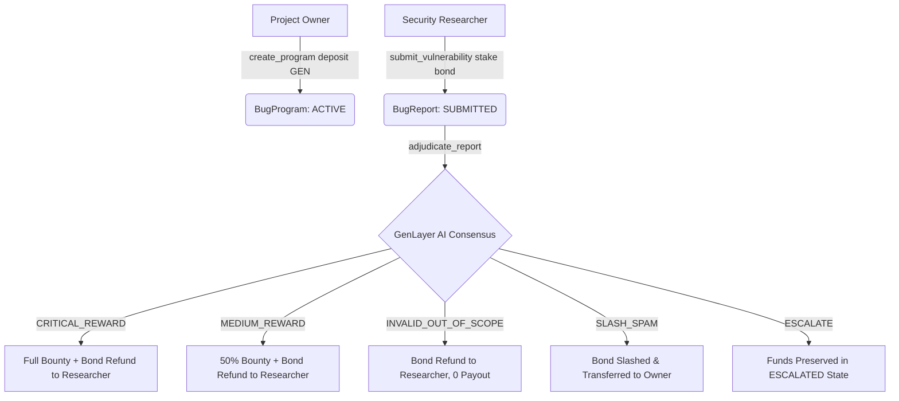

# VulnGuard: Decentralized AI-Powered Smart Contract Bug Bounty Protocol

**VulnGuard** is a GenLayer **Intelligent Contract** that serves as a decentralized, trustless bug bounty and security vulnerability adjudication platform. Project owners deposit bounty pools and define security scope policies, while security researchers submit Proof-of-Concept (PoC) reports accompanied by anti-spam bonds. AI consensus nodes autonomously fetch policies and PoCs, evaluate security claims, and resolve payouts or bond slashes without centralized intermediaries.

---

## Deployment Evidence

| Parameter | Value |
| --- | --- |
| **Contract File** | [`vuln_guard.py`](file:///c:/Users/Admin/Documents/genlayer/intel%20contract/VulnGuard/vuln_guard.py) |
| **GenLayer Version** | `v0.2.16` |
| **VM Dependency** | `py-genlayer:1jb45aa8ynh2a9c9xn3b7qqh8sm5q93hwfp7jqmwsfhh8jpz09h6` |
| **Execution Environment** | GenVM / Optimistic AI Consensus |

---

## Worked Example (Illustrative Call & Expected Output)

### 1. Program Creation (`create_program`)
- **Project Owner Call**:
  - `title`: `"DeFi Vault Core Smart Contract Security"`
  - `policy_url`: `"https://raw.githubusercontent.com/luongnhan9999/VulnGuard/main/examples/security_policy.txt"`
  - `value`: `10000000000000000000` (10 GEN bounty pool escrowed)
- **Outcome**: Returns `program_id = "1"`, program status set to `"ACTIVE"`.

### 2. Vulnerability Submission (`submit_vulnerability`)
- **Security Researcher Call**:
  - `program_id`: `"1"`
  - `report_url`: `"https://raw.githubusercontent.com/luongnhan9999/VulnGuard/main/examples/poc_report_critical.txt"`
  - `value`: `100000000000000000` (0.1 GEN anti-spam bond staked)
- **Outcome**: Returns `report_id = "1"`, report status set to `"SUBMITTED"`.

### 3. Autonomous AI Adjudication (`adjudicate_report`)
- **Execution Pipeline**:
  - Consensus Leader fetches `policy_url` and `report_url` using `gl.nondet.web.render`.
  - Leader executes structured security LLM evaluation prompt via `gl.nondet.exec_prompt`.
  - Validator nodes independently run the leader evaluation and enforce semantic consensus.
- **Expected Verdict & State Outcome**:
  - `verdict`: `"CRITICAL_REWARD"`
  - `confidence`: `95`
  - `reason`: `"Demonstrates clear reentrancy vulnerability in withdraw() allowing pool depletion within scope."`
  - `status`: `"RESOLVED"`
  - **Financial Settlement**: Researcher receives full 10 GEN bounty payout + full 0.1 GEN anti-spam bond refund.

---

## Core Architecture & State Model



### Data Structures (`@allow_storage`)

#### `BugProgram`
- `id`: `str` — Unique program identifier.
- `owner`: `str` — Hex address of project owner.
- `title`: `str` — Title of the security bounty program.
- `policy_url`: `str` — Public URL hosting the program's security scope and guidelines.
- `bounty_pool`: `bigint` — Escrowed bounty pool balance (in wei/GEN).
- `status`: `str` — `"ACTIVE"` or `"CLOSED"`.

#### `BugReport`
- `id`: `str` — Unique vulnerability report identifier.
- `program_id`: `str` — Reference to parent `BugProgram`.
- `researcher`: `str` — Hex address of reporting researcher.
- `report_url`: `str` — Public URL hosting the PoC vulnerability report.
- `staked_bond`: `bigint` — Anti-spam bond amount staked by researcher.
- `verdict`: `str` — `"NONE"`, `"CRITICAL_REWARD"`, `"MEDIUM_REWARD"`, `"INVALID_OUT_OF_SCOPE"`, `"SLASH_SPAM"`, or `"ESCALATE"`.
- `confidence`: `bigint` — AI evaluation confidence score (0-100).
- `reason`: `str` — Brief explanation of verdict.
- `status`: `str` — `"SUBMITTED"`, `"RESOLVED"`, `"SLASHED"`, or `"ESCALATED"`.

---

## Public API Specification

### Write Methods
- `create_program(title: str, policy_url: str) -> str` (`payable`)
  - Escrows project bounty pool deposit and creates bug program.
- `submit_vulnerability(program_id: str, report_url: str) -> str` (`payable`)
  - Stakes researcher anti-spam bond and submits PoC report.
- `adjudicate_report(report_id: str) -> None`
  - Triggers Optimistic AI Consensus evaluation and handles financial payouts/slashing.
- `close_program(program_id: str) -> None`
  - Allows program owner to close active program and withdraw remaining pool.

### View Methods
- `get_program(program_id: str) -> str` — Returns JSON string of bug program details.
- `get_report(report_id: str) -> str` — Returns JSON string of vulnerability report details.
- `get_program_counter() -> int` — Returns total programs created.
- `get_report_counter() -> int` — Returns total reports submitted.

---

## How Optimistic AI Consensus Works

Adjudication executes nondeterministic external calls inside `gl.vm.run_nondet`:

```python
def validator_fn(leader_res) -> bool:
    if not isinstance(leader_res, gl.vm.Return):
        return False
    ...
    mine_data = leader_fn()
    v_leader = str(leader_data.get("verdict", "")).upper().strip()
    v_mine = str(mine_data.get("verdict", "")).upper().strip()
    return v_leader == v_mine
```

1. **Web Rendering & Sanity Check**: Policy and PoC URLs are fetched via `gl.nondet.web.render`. Unreadable or 404 URLs are automatically flagged as `SLASH_SPAM` (for dead PoCs) or `ESCALATE` (for missing policies).
2. **Strict Categorical Prompting**: LLM outputs JSON containing standard verdict categories.
3. **Confidence Thresholding**: If `confidence < 65`, verdict automatically downgrades to `"ESCALATE"` to ensure validator alignment.
4. **Semantic Consensus**: Validator re-runs evaluation independently and compares categorical verdicts (`v_leader == v_mine`).

---

## Local Development & Testing

```bash
# 1. Install dependencies
pip install -r requirements-dev.txt

# 2. Run unit test suite
pytest tests/
```
